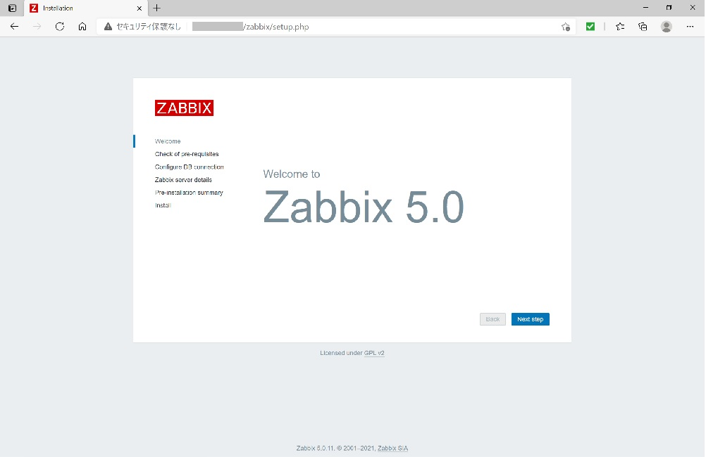
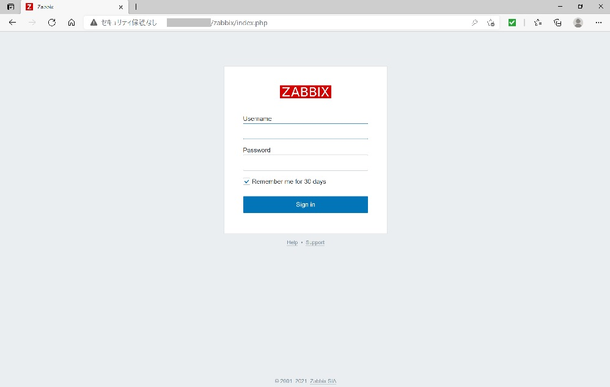
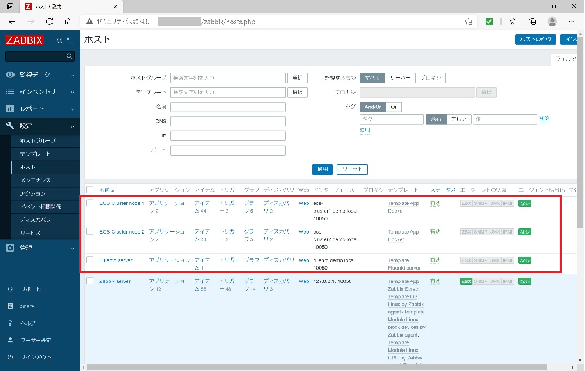

# ansible_zabbix_setup
## はじめに
Ansibleを使用してZabbixサーバを構築するためのPlaybookです。
Playbookでは、下記作業を自動化しています。
- Zabbixインストール
- Zabbixサーバへの監視対象ホストの登録、Zabbixテンプレートファイルのインポート

なお、インストールするZabbixのバージョンは、Zabbix 5.0とし、<br>
対象OSは、Linux (CentOS 7 / Amazon Linux 2)としています。

### システム構成
- Zabbix : Zabbix 5.0 LTS
- OS : Linux (CentOS 7 / Amazon Linux 2)
- Webサーバ : Apache HTTP Server 2.4
- PHP : PHP 7.2
- DBMS : MariaDB 5.5

### 動作環境
下記環境で動作確認を行っています。  

| OS | ソフトウェア |
|--|--|
| CentOS 7.9.2009 | Ansible 2.9.18<br>Python 2.7.5 |
| Amazon Linux 2  | Ansible 2.9.18<br>Python 2.7.18 |

<br>

## ディレクトリ構成
```
.
├── group_vars
│   └── zabbix.yml
├── roles
│   ├── disable_selinux
│   │   ├── handlers
│   │   │   └── main.yml
│   │   └── tasks
│   │       └── main.yml
│   ├── install_mariadb
│   │   ├── handlers
│   │   │   └── main.yml
│   │   └── tasks
│   │       └── main.yml
│   └── install_zabbix
│       └── tasks
│           └── main.yml
├── templates
│   ├── zabbix_server.conf.j2
│   └── zbx_template_fluentd_server.xml
├── add_zabbix_host.yml
├── hosts
├── site.yml
├── zabbixserver_disable_selinux.yml
├── zabbixserver_install_mariadb.yml
└── zabbixserver_install_zabbix.yml
```
**Playbook**
- site.yml<br>
対象OSにZabbixをインストールするPlaybookです。<br>
site.ymlを親Playbookとして、子のPlaybook(zabbixserver_***.yml)を読み込む形式となります。さらに、子のPlaybookから各Roleを呼び出すことで、実際のTaskを処理します。
- add_zabbix_host.yml<br>
Zabbixインストール後にホスト登録とテンプレートのインポートをするPlaybookです。

**hosts、group_vars/zabbix.yml**<br>
ホストIPアドレス、DBパスワード等、Playbookのパラメータとなる変数を管理するファイルです。実行環境に合わせて、ファイル内のIPアドレスや初期設定したいパスワードを編集します。

<br>

## セットアップ
Ansible及びPlaybookのセットアップを行います。 

### Ansibleのインストール
Ansibleのインストールを行います。

```
# Ansibleをインストール
sudo yum update
sudo yum install ansible

# Ansibleのバージョン確認
ansible --version

```

### SSH接続設定
Ansibleを使用して環境構築を行うサーバにssh接続します。

```
# SSHの公開鍵と秘密鍵を作成
ssh-keygen -t rsa

# SSHの公開鍵を接続先サーバに転送
ssh-copy-id -i ~/.ssh/id_rsa.pub {ユーザ名}@{ホスト名・IPアドレス}

```
### Gitリポジトリのクローン
Playbookは[Gitリポジトリ](https://github.com/sfarm21/ansible_zabbix_setup.git)からクローンしてください。 

<br>

## Playbook実行
Ansibleを使用してPlaybookの定義を実行します。 

```
# Zabbixインストール用Playbookを実行
ansible-playbook -i hosts site.yml
```
処理が正常に終了すると、Zabbix 管理画面の初回設定画面にアクセスできるようになります。


画面に従って設定を進めて行くと、最後にログイン画面が出てきます。



ログイン画面まで進んだら、2つ目の「Zabbixホスト登録、テンプレートインポート用Playbook」を実行します。
（ログイン画面まで進めれば、次回からはログイン画面が最初に表示されるようになります。管理画面の初回画面がログイン画面でないと、次のホスト登録用のPlaybookは失敗します。）
```
# Zabbixホスト登録、テンプレートインポート用Playbookを実行
ansible-playbook -i hosts add_zabbix_host.yml
```
Playbookが正常に終了したのを確認後、管理画面からログインします。左ペインから設定→ホストと確認すると、監視対象ホストが登録されていることが確認できます。



## 参考情報
本Playbookを作成にあたって下記書籍を参考にさせていただきました。<br>
また、基本となるインストール手順は、[Zabbix公式サイト](https://www.zabbix.com/jp/download?zabbix=5.0&os_distribution=centos&os_version=7&db=mysql&ws=apache
)を基にしました。
- Ansible構築・運用ガイドブック - 八木澤 健人(著)　マイナビ出版
